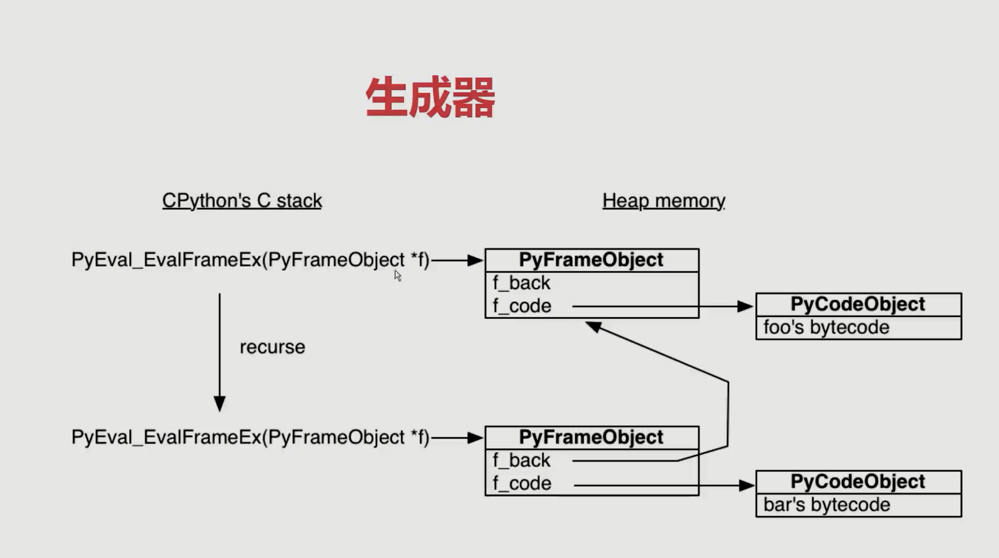

# 面试题

二面主要针对项目，会深入问你问题.

## 基础题

### tuple与 list 的区别

* 都是序列，都可以通过索引访问，元组所指向的内存中的内容不可变.
* 元组无法进行复制，因为它是不可变的。如果运行 tuple(t)，它将返回t本身.

### Python 正则表达式

* 贪婪匹配，尽可能多的匹配符合条件的内容。标识符`+`，`?`，`*`，`{n}`，`{n,}`，`{n,m}`
* 非贪婪匹配，一旦发现匹配符合要求，立马就匹配成功，不再继续匹配下去。`+?`，`??`，`*?`，`{n}?`，`{n,}?`，`{n,m}?`
* 数字：`^[0-9]*$`
* 由26个英文字母组成的字符串：`^[A-Za-z]+$`

- `re.match()` : 尝试从字符串的**起始位置**匹配一个模式，如果不是起始位置匹配成功的话，`match()` 就返回none。
- `re.search()`：扫描整个字符串并返回第一个成功的匹配。
- `re.sub()`: 用于替换字符串中的匹配项。
- `re.compile()`：用于编译正则表达式，生成一个正则表达式（ Pattern ）对象，供 match() 和 search() 这两个函数使用。
- `re.findall()`: 在字符串中找到正则表达式所**匹配的所有子串**，并返回一个列表，如果没有找到匹配的，则返回空列表。

### 统计代码耗时，性能调优

* 基本的查询运行时间：`time`

* 通过 `timeit` 计算代码执行之间：

  ```python
  import timeit
  print(timeit.timeit(lambda: "-".join(map(str, range(100))), number=10000))
  ```

* `line_profiler`, 调查 Python 的 CPU 密集型问题最强大的工具。在需要分析的函数上添加装饰器`@profile`，可以统计代码行数，每次执行时间及时间占比，总执行时间。

### GIL（全局解释器锁）

**线程**全局锁（GIL），即Python为了保证**线程**安全而采取的独立线程的限制，说白了**就是一个核只能在同一时间运行一个线程**. 

* **对于IO密集型任务**（如time.sleep(1))，能够释放锁，**操作系统的进程切换代价高于线程**，Python **多线程** 起到作用. 
* **对于CPU密集型任务**，Python 多线程几乎占不到任何优势，还可能因为争夺资源而变慢，**无法充分利用多核优势**，所以使用**多进程**.
  * 解决办法就是多进程以及Python里面的协程，不过协程也是单线程模式，采用单核CPU，需要程序员自己去控制任务调度，降低了切换提升性能
* 可以通过继承Thread来实现多线程.

### 协程

协程是进程和线程的升级版，**进程和线程都面临着内核态和用户态的切换问题而耗费许多切换时间**，而**协程就是用户自己控制切换的时机**，不再需要陷入系统的内核态.

**C10M问题**：如何利用8核CPU，64G内存，在10Gpbps的网络下保持1000w并发连接. 这就是协程所要实现的.

* 回调模式编程复杂度高
* 同步编程的并发性不高
* 多线程编程需要线程间同步，锁降低了并发性能

协程的解决方式是：

* **采用同步的方式去编写异步的代码**
* **使用单线程去切换任务**
  * 线程是由操作系统切换，单线程意味着我们需要程序员自己去调度任务.
  * 不在需要锁，并发性高，如果单线程内切换函数，性能高于线程切换

传统的函数调用过程：A→B→C，函数切换(栈)之后，这个函数就跳出去了。我们希望出栈的时候这个函数可以暂停，并且在适当的时候恢复该函数执行。着就促使了协程（**有多个入口的函数，可以暂停的函数，可以传入值得函数**）得产生.

* 生成器是有状态得。我们可以把那些消耗IO(耗时)的操作全部放在生成器里面，主线程不要放`time.sleep()`等IO操作. 整个协程调度依然是是生成器+事件循环。**协程是单线程模式**.
* Python 内部使用了 `async` 和 `await` 实现了原生协程.

### Python 多线程和多线程

* 进程是**资源分配的最小单位**，线程是**CPU调度的最小单位**，进程和线程的主要差别在于它们是**不同的操作系统资源管理方式**。一个进程可以包含多个线程。
* **进程具有独立的地址空间**，一个进程崩溃，在保护模式下不会影响其他进程运行。而线程只是一个进程的不同执行路径。
* 线程有自己的堆栈和局部变量，但线程之间没有单独的地址空间，一个线程死掉就整个进程死掉。所以一般多进程比多线程的程序更健壮。

### Python 常用类库

* **基础库**：`json`, `os`, `sys`, `time`
* **线程**：`theading`, `concurrent.futures`(concurrent线程池，多线程和多进程接口一致)、`multiprocessing`
* **并发库**：`asyncio`, 用于解决异步 `python io` 编程的一整套解决方案。

### 如何判定文件是否存在

* 使用 `os` 模块中的 `os.path.exists()` 方法用于检验文件是否存在。 判断文件是否存在

### [1,2,3,4] 变成 '1234'

```python
a = reduce(lambda x, y: str(x)+str(y), [1,2,3,4])
```

### map, reduce, filter, sorted

```python
#!/usr/bin/env python
# -*- coding: utf-8 -*-

"""
source: https://github.com/JoJo720/Interview/blob/main/语言相关/Python/code/02-map-filter-reduce-sorted.py
"""

if __name__ == '__main__':
    # map 函数是对一个序列的每个项一次执行函数
    # 返回 map 对象
    a = map(lambda x: x * 2, [1, 2, 3])
    print(list(a)) # [技术面, 4, 6]
    a = map(lambda x, y: x * y, [1, 2, 3], [4, 5, 6, 8])
    print(list(a)) # [4, 10, 18]

    # filter 函数的功能相当于一个过滤器。调用一个bool_func来迭代遍历每个seq中的元素
    # 返回一个filter对象
    a = filter(lambda x: x > 5, [1, 2, 5, 6, 7])
    print(list(a)) # [6, 7]

    # reduce 函数是对一个序列的每个项迭代调用函数
    # 返回列表
    from functools import reduce
    a = reduce(lambda x, y: x * y, range(1, 4))
    print(a) # 6

    # sorted 函数对所有可迭代的对象进行排序操作
    # 返回列表
    students = [('john', 'A', 15), ('jane', 'B', 12), ('dave', 'B', 10)]
    a = sorted(students, key=lambda s: s[2])
    print(a) # [('dave', 'B', 10), ('jane', 'B', 12), ('john', 'A', 15)]
```

### 内存管理机制（垃圾回收）

python 主要使用**引用计数**来跟踪和回收垃圾。在引用计数的基础上，通过**标记-清除**(mark and sweep)解决容器对象可能产生的循环引用问题，通过**分代回收**(generation collection)以空间换时间的方法来提高垃圾回收效率。

* **引用计数**：PyObject是每个对象必有得内容，其中ob_refcnt就是做为引用计数。当一个对象有新的引用时，它的ob_refcnt就会增加，当引用它的对象被删除，它的ob_refcnt就会减少。当引用计数为0时，该对象的生命才结束。
  * 优点：简单、实用性
  * 缺点：维护引用计数消耗资源、循环引用
* **标记清除机制**：基本思路是先按需分配，等到没有空闲内存的时候从寄存器和程序栈上的引用出发，遍历以对象为节点，以引用为边构成的图，把所有没标记的对象释放
* **分代技术**：分代回收的整体思路是，将系统中的所有内存块根据其存活时间划分为不同的集合，每个集合就成为一个”代“，垃圾收集频率随着”代“的存活时间的增大而减少，存活时间通常利用经过几次垃圾回收来度量.
  * python默认定义了三代对象集合，索引数越大，对象的存活时间越长。
  * 举例：当某些内存块M经过了3次垃圾收集的清洗之后还存活时，我们就将内存块M划到一个集合A中去，而新分配的内存都划分到集合B中。当垃圾收集工作开始时，大多数情况下只对集合B进行垃圾回收，而对集合A进行垃圾回收要隔相当长一段时间后才进行，这就使得垃圾回收机制需要处理的内存少了，效率自然就提高了。在这个过程中，集合B中的某些内存块由于存活时间长而被转移到集合A中，当然，集合A中实际上也存在一些垃圾，这些垃圾的回收会因为这种分代机制而被延迟。

### 迭代器、生成器

**迭代器**：使用 `__iter__` 和 `__next__` 魔法方法实现，提供一种集合元素遍历的方法，可以用来遍历数据。而可迭代对象只是使用了`__iter__`方法。

**生成器**是一种特殊的迭代器，生成器自动实现了**迭代器协议**，而不需要手动实现。**生成器在迭代的过程中可以改变当前迭代值**，而修改普通迭代器的当前迭代值往往会发生异常。

**生成器可以控制函数的暂停停止和运行。生成器可以产出值，可以接收值，另外yield from还能在调用方与子生成器之间建立一个双向通道.**

一个例子：**生成器大文件处理**

```python
# 大文件读取，一行500G

def myreadlines(f, newline):
    buf = ""
    while True:
        while newline in buf:
            pos = buf.index(newline)
            yield buf[:pos]
            buf = buf[pos + len(newline)]
        chunk = f.read(4096)
        if not chunk:
            # 读到结尾
            yield buf
            break
        buf += chunk

if __name__ == '__main__':
    with open("open.txt") as f:
        for line in myreadlines(f, "{|}"):
            print(line)

os.path.join(os.path.dirname(os.path.abspath(__file__)), "..", "config.yaml")
```


### for else 语句

```python
for i in range(5):
    if i == 1:
        print('in for')
else:
    print('in else')
print(' after for loop')
# in for
# in else
# after for loop

for i in range(5):
    if i == 1:
        print('in for')
        break
else:
    print('in else')
print(' after for loop')
# in for
# after for loop
```

### try else 语句

```python
def test():
    try:
        print("00-code started")
        raise KeyError

    except KeyError as e:
        # 有异常
        print("key error")
    else:
        # 没有异常
        print("other error")
    finally:
        # 不管有没有异常
        print("finally")
```

### 函数工作原理



* python.exe Py_Eval_EvalFramEx(c函数)去执行foo函数
* 首先会创建一个栈帧（stack frame）
* python 一切皆对象，栈帧对象， 字节码对象
* 所有的栈帧都是分配在堆内存上，这就决定了栈帧可以独立于独立于调用者存在

### 一行代码执行的全过程

在Python解释器接手之前，Python会执行三个步骤：**词法分析，语法解析和编译**。这三步将python源代码转换为code object，它包含解释器可以理解的指令。而解释器的工作就是解释code object中的指令。

大多数解释型语言包括Python，确实会有编译这一步。而Python被称为解释型的原因是相对于编译型语言，它在编译这一步的工作相对较少。

####  解释器

Python的解释器是一个虚拟机，模拟真实计算机软件。这个虚拟机是**栈机器**，**它用几个栈来完成操作**(而寄存器机器则是从特定的内存地址读写数据)。

Python解释器是一个字节码解释器：它的输入是一些命令集合，称作**字节码**。当你写Python代码时，词法分析器，语法解析器和编译器生成code object让解释器去操作。每个code object都包含一个要被执行的指令集合——字节码，另外还需要一些解释器需要的信息。字节码时Python代码的一个中间层表示：它以一种解释器可以理解的方式来表示源代码。这和汇编语言作为C语言和机器语言的中间表示很类似。

Python标准库中的**dis模块**是一个字节码反汇编器，反汇编器将 为机器而写的底层代码作为输入，比如汇编码和字节码，然后以人类可读的方式输出。

#### 栈帧

`Python` 虚拟机是一个栈机器。它能顺序执行指令，在指令跳转时，压入或弹出栈值.

frame: 一个frame是一些信息的集合和代码的执行上下文，**frames在Python代码执行时动态创建和销毁**。每个frame对函数的一次调用。所以每个frame只有一个code object与之关联，而一个code object可以很多frame.

frame存在于调用栈中，一个和之前说的不同的栈。解释器在执行字节码时操作的栈，我们叫它数据栈。其实还有第三个栈，叫块栈，用于特定的控制流块，比如循环和异常处理。调用栈中的每个frame都有它自己的数据栈和块栈.

#### 为什么一个frame必须拥有一个数据栈呢？

Python很少依赖于每个frame有一个数据栈的特性。在Python中几乎所有的操作都会清空数据栈，所以所有的frame公用一个数据栈没有问题.

### 列表推导式、生成器表达式、字典推导式

```python
#!/usr/bin/env python
# -*- coding: utf-8 -*-

"""
source: https://github.com/JoJo720/Interview/blob/main/语言相关/Python/code/04-list-dict-genarator.py
"""


def handle_item(item):
    return item * item


if __name__ == "__main__":
    # 列表生成式
    odd_list = [handle_item(i) for i in range(21) if i % 2 == 1]
    print(odd_list)

    # 生成器表达式，这个经常考
    odd_list = (handle_item(i) for i in range(21) if i % 2 == 1)
    print(odd_list)  # generator 可迭代

    # 字典推导式
    my_dict = {"bobby": 22, "bobby1": 23, "imooc.com": 5}
    reversed_dict = {value: key for key, value in my_dict.items()}
    print(reversed_dict)

    # 集合推导式 set
    my_set = {key for key, value in my_dict.items()}
    print(my_set)
```

### Python 中单下划线和双下划线

- `__foo__`: 一种约定，Python内部的名字，用来区别其他用户自定义的命名，以防冲突，如例如`__init__()`,`__del()__`,`__call()__`这些特殊方法.
- `_foo`: 一种约定,用来指定变量私有. 程序员用来指定私有变量的一种方式.不能用from module import * 导入，其他方面和公有一样访问
- `__foo`: 这个有真正的意义：解释器用`_classname__foo`来代替这个名字，以区别和其他类相同的命名，它无法直接像公有成员一样随便访问，通过`对象名._类名__xxx`这样的方式可以访问

### 闭包

* 闭包是装饰器的基础，装饰器是闭包的一种表现形式.
* 闭包(closure)是函数式编程的重要语法结构。闭包也是一种组织代码结构，它同样提高了代码的可重复使用性.
* **当一个内嵌函数引用其外部作用域的变量，我们就会得到一个闭包。**创建闭包必须满足以下条件。
  * 必须有一个内嵌函数
  * 内嵌函数必须引用外部函数的变量
  * 外部函数的返回值必须是内嵌函数

### 装饰器

修改其他函数的功能，使得代码更加简洁。原理就是将函数作为参数传给另一个函数。例子有：

* 给函数添加日志输出
* 自己写库的时候使用抽象基类里面的 `@abstractmethod`，强制子类必须重写抽象基类的get()方法

```python
#!/usr/bin/env python
# -*- coding: utf-8 -*-

"""
source: https://github.com/JoJo720/Interview/blob/main/语言相关/Python/code/03-decorator.py
"""

def log(func):
    def wrapper(*args, **kwargs):
        list(map(lambda arg: print(arg), args))
        list(map(lambda k: print(k), kwargs.items()))
        return func(*args, **kwargs)
    return wapper

@log
def now(*args, **kwargs):
    print("now func")

if __name__ == '__main__':
    now(1, 2, 3, a=1, b=2, c=3)
```

### Python 自省机制

自省就是面向对象的语言所写的程序在运行时，所能知道对象的类型。也就是通过一定的机制可以查询到对象的内部结构。比如内置的函数`type(),dir(),isinstance()`

### Python 重载

* 函数重载主要解决两个问题：可变参数类型和可变参数个数.
* 另外，一个基本的设计原则是，仅仅当两个函数除了参数类型和参数个数不同之外，其功能是相同的，此时才使用重载函数，如果两个函数的功能其实不同，那么就不应该使用函数重载，而应当使用不同名字的函数.

### `__new__` 和 `__init__` 的区别

```python
#!/usr/bin/env python
# -*- coding: utf-8 -*-

"""
source: https://github.com/JoJo720/Interview/blob/main/语言相关/Python/code/05-new-and-init.py
"""


class User:
    def __new__(cls, *args, **kwargs):
        """
        在对象生成之前，控制对象生成过程
        如果new方法不返回对象，则不会调用init函数
        """
        print("__new__")
        # return super().__new__(cls)

    def __init__(self, name):
        """
        完善对象生成
        """
        print("__init__")
        self.name = name


if __name__ == '__main__':
    name = User("bobby")
```

### 单例模式

单例模式是一种常用的软件设计模式。在它的核心结构中只包含一个被称为单例类的特殊类。通过单例模式可以**保证系统中的一个类只有一个实例而且该实例易于外界访问**，从而方便对实例个数的控制并节约系统资源。如果希望在系统中某个类的对象只有一个，单例模式就是最好的解决方案。

**`__new__`在`__init__`之前被调用，用于生成实例对象**。利用这个方法和类的属性的特点可以实现设计模式的单例模式。单例模式是指创建唯一对象，单例模式设计的类只能是实例，这个绝对常考啊.绝对要记住1~2个方法,当时面试官是让手写的.

```python
#!/usr/bin/env python
# -*- coding: utf-8 -*-

"""
source: https://github.com/JoJo720/Interview/blob/main/语言相关/Python/code/06-single-patterns.py
"""


# 1 import 方法
# mysingleton.py
class My_Singleton(object)
    def foo(self):
        pass

my_singleton = My_Singleton()
# to use
from mysingleton import my_singleton
my_singleton.foo()


# 技术面 使用 __new__ 方法
class Singleton(object):
    def __new__(cls, *args, **kwargs):
        if not hasattr(cls, '_instance'):
            orig = super(Singleton, cls)
            cls._instance = orig.__new__(cls, *args, **kwargs)
        return cls._instance

class MyClass(Singleton):
    a = 1
    
    
# 3 装饰器版本
def singleton(cls):
    instance = {}
    def get_instance(*args, **kwargs):
        if cls not in instance:
            instance[cls] = cls(*args, **kwargs)
        return instance[cls]
    return get_instance


@singleton
class MyClass:
    pass


# 4 共享属性
# 创建实例时把所有实例的 __dict__ 指向同一个字典，这样它们具有相同的属性和方法
class Borg(object):
    _state = {}
    def __new__(cls, *args, **kwargs):
        ob = super(Borg, cls).__new__(cls, *args, **kwargs)
        ob.__dict__ = cls._state
        return ob

class MyClass(Borg):
    a = 1
```

### `super()` 函数

```python
from threading import Thread

class A:
    def __init__(self):
        print("A")

class B(A):
    def __init__(self):
        print("B")
        super().__init__()  # 这里可以直接用 super(),而不需要加类名

class MyThread(Thread):
    def __init__(self, name, user):
        self.user = user
        super(MyThread, self).__init__(name=name)

if __name__ == "__main__":
    b = B()

# mixin模式单一, 类似于接口
# minxin功能单一
# 不和基类关联, 基类可以不和minx关联就可以完成初始化
# 不要使用super这种方法
```

### 上下文管理器协议

上下文管理器 `__enter__`  和 `__exit__` ，`enter` 就是获取资源，exit 就是释放资源，这个在文件读写比较常见，像 with 语句，就是典型的上下文协议，进行文件操作的时候，不进行 f.close() 就是这个原因，因为with执行完之后，执行了exit，释放了文件锁。

### 内存分配器（对象产生过程）

> 参考：[Python内存分配器（如何产生一个对象的过程）](https://www.cnblogs.com/Leon-The-Professional/p/10137379.html)

自顶向下：对象分配，对象分配器，低级分配器，malloc，OS层

- **第0层：通用的基础分配器：对系统内存进行申请。**Python 中并不是在生成所有对象时都去调用内存申请，而是根据要分配的内存大小来改变分配方法。(源码中规定：当申请的内存大小如果大于256字节，直接使用malloc()，如果小于256就用第1层第2层)
- **第1层：低级内存分配器**：当需要分配的内存小于256字节的对象时，就利用第一层的内存分配管理器，在这一层会事先从第0层开始迅速保留内存空间，将其存储起来。第一层的作用就是管理存储起来的空间。(**其实就是一个对象池，对它进行管理，以应对频繁产生又释放的对象**)。
- **第2层：对象分配器**：负责管理pool内的block的。这一层将block的开头地址返回给申请者，并释放block等。
- 第3层：对象特有的分配器：对象有列表和元组等类型。在生成他们的时候要使用**各自特有的分配器**。

Python在生产字典对象时，分配器的交互如下图示


### 深拷贝与浅拷贝以及引用

* 浅拷贝：**只拷贝数据集合最外边的一层**，深层的数据只是做了**内存地址引用**，并没有拷贝.
* 深拷贝：完全拷贝数据集合的所有数据，**与源数据再无相关**，不是对象的引用.

```python
import copy
a = [1, 2, 3, 4, ['a', 'b']]  # 原始对象

b = a  # 赋值，传对象的引用
c = copy.copy(a)  # 对象拷贝，浅拷贝
d = copy.deepcopy(a)  # 对象拷贝，深拷贝

a.append(5)  #修改对象a
a[4].append('c')  #修改对象a中的['a', 'b']数组对象

print 'a = ', a
print 'b = ', b
print 'c = ', c
print 'd = ', d

输出结果：
a = [1, 2, 3, 4, ['a', 'b']]  # 原始对象 1586435527680
a =  [1, 2, 3, 4, ['a', 'b', 'c'], 5] # 1586435527680
b =  [1, 2, 3, 4, ['a', 'b', 'c'], 5] # 赋值，传对象的引用 1586435527680

c =  [1, 2, 3, 4, ['a', 'b', 'c']] # 浅拷贝 1586438321664
d =  [1, 2, 3, 4, ['a', 'b']] # 深拷贝 1586435536320
```

### 可变与不可变对象

- 可变对象：可变对象可以在其id()保持固定不变的情况下改变它的取值。即**改变它的取值不会改变对象所指的内存地址。**
- 不可变对象：具有固定值的对象。（**数字、字符串和元组**）这样的对象不能被改变。如果确实要存储一个不同的值，内部必须创建一个新的对象。
- id(object)： 函数用于获取对象的内存地址

### 并发、并行、同步、异步、阻塞、非阻塞

- 并发和并行 
  - 并发：宏观上并发，多个程序一个时间段内在一个cpu运行，但是一个时间点只有一个程序运行 
  - 并行：任意时间点，有多个程序同时运行在多个cpu. **一个程序至少有一个进程,一个进程至少有一个线程. 并行编程要求程序合理使用多进程和多线程编程。**
- 同步和异步(消息通信机制) 
  - 同步：代码调用IO操作时，必须等待IO操作完成才返回的调用方式 
  - 异步：代码调用IO操作时，**不必等待IO操作完成就返回的调用方式**
- 阻塞和非阻塞(函数调用机制) 
  - 阻塞：指函数调用时，当前线程被挂起 
  - 非阻塞：指函数调用时，当前线程被不会挂起

### Asyncio 并发编程

* select/poll/epoll: 这三个都是IO多路复用机制。IO多路复用就是通过一种机制，**一个进程可以监视多个描述符**，一旦某个描述符就绪(一般是读就绪或者写就绪)，能够通知程序进行相应的读写操作。select，poll，epoll本质都是**同步IO**，因为他们都需要在读写事件就绪后自己负责进行读写，也就是说这个读写过程是**阻塞的**，而异步IO则无需自己负责进行读写，异步IO的实现会负责把数据从内核拷贝到用户空间.
  * epoll并不代表一定比select好，epoll是红黑树实现的，效率高。
  * **并发高，连接活跃度不高的**，用epoll（web网站）
  * 并发性不高，同时连接很活跃，select比epoll好
* asyncio 是 Python 用于解决异步io编程得一整套解决方案
  * 事件循环+回调（驱动生成器）+epoll（**IO多路复用**），目前主流框架使用**IO多路复用模型**，异步IO模型还不够成熟.
  * 基于 yield from 得协议和任务，可以让你用顺序得方式去编写异步的代码.

### Pandas

直观的处理关系型、标记型数据

* 数据的同构和异构
  * 异构：探讨不同数据的共性，如鸟和飞机都会飞，数据源可能同时包含鸟和飞机。**数据源不同**。
  * 同构：讨论一种数据。如一一群鸟类或者一批飞机，数据源为包含鸟类的数据或包含飞机的数据。**数据源相同**。
* SQL的同构和异构
  * 同构SQL：指两个SQL语句可编译的部分是相同的，只是参数不同.
  * 异构SQL：指两个SQL语句整个格式都不同.

### 知识图谱

* **实体1、关系、实体2**
* **实体、属性、属性值**

### 哈希表(HASH TABLES)原理

> 参考：[Python字典对象实现原理](https://foofish.net/python_dict_implements.html)、[Python的dict实现原理和Java的HashMap之间的区别](https://zhuanlan.zhihu.com/p/33496977)

根据键值对(key-value)而直接访问数据。它通过把key和value映射到表中异构位置来访问记录，这种查询速度非常快。这个映射函数叫做哈希函数，存放值的数组叫做哈希表。哈希函数的实现方式决定了哈希表的搜索效率。具体过程

* 数据添加：把key通过哈希函数转换成一个整型数字，然后就该数字对数组长度进行取余，取余结果当作数组的下标，将value存储在以该数字为下标的数组空间里.
* 数据查询：再次使用哈希函数将key转换为对应数组下标，并定位到数组的位置获取 `value`.

当数据量大的时候，就会出现哈希冲突。通常做法有两种，Python采用开放寻址法：

* **开放寻址法**：开放寻址法中，所有的元素都存放在散列表里，当产生哈希冲突时，通过一个**探测函数**计算出下一个候选位置，如果下一个获选位置还是有冲突，那么不断通过探测函数往下找，直到找个一个空槽来存放待插入元素。
* **链地址法**：把所有**同义词**用单链表连接起来的方法。在这种方法中，Hash表每个单元中存放的不再是记录本身，而是对应同义词单链表的表头指针。

### 工厂模式

> 参考：[python实现简单工厂模式](https://www.cnblogs.com/-wenli/p/10434742.html)

* 结构
  * Product：抽象产品角色。**是所有具体产品角色的父类**，它描述所有实例所共有的**公共接口**。
  * ConcreteProduct：具体产品角色。**继承自抽象产品角色，一般为多个，是简单工厂模式的创建目标**。工厂类返回的都是该角色的某一具体产品.
  * Factory：工厂角色。简单工厂模式的核心，它负责实现**创建所有具体产品类的实例**。工厂类可以被外界直接调用，创建所需的产品对象。

## 数据库

### 必备知识

* [SQL](https://github.com/CyC2018/CS-Notes/blob/master/notes/SQL.md)
* [MySQL](https://github.com/CyC2018/CS-Notes/blob/master/notes/MySQL.md)
* [Redis](https://github.com/CyC2018/CS-Notes/blob/master/notes/Redis.md)
* [数据库系统原理](https://github.com/CyC2018/CS-Notes/blob/master/notes/%E6%95%B0%E6%8D%AE%E5%BA%93%E7%B3%BB%E7%BB%9F%E5%8E%9F%E7%90%86.md)
* [MongoDB](https://github.com/0voice/interview_internal_reference/tree/master/11.MongoDB%E7%AF%87)

### 三范式

* 字段不可拆分：保证字段的原子性，否则就不是关系型数据库
* 唯一性：有主键，其他字段可以与主键发生关联
* 非主键字段不能相互依赖

### 乐观锁和悲观锁

* 悲观锁：假定会发生冲突，屏蔽一切可能违反数据完整性的操作
* 乐观锁：假设不会发生并发冲突，只在提交操作时检查是否违反数据完整性

### mysql查询优化

#### 使用 Explain 进行分析

使用Explain分析SELECT查询语句，比较重要的字段有。

- select_type: 查询类型，有简单查询、联合查询、子查询
- key: 使用的索引
- rows：扫描的行数

#### 优化数据访问

- 减少请求的数据量
  - 只返回必要的列：最好不要使用SELECT * 语句
  - 只返回必要的行：使用LIMIT语句限制返回的数据
  - **缓存重复查询的数据**：使用缓存可以避免在数据库中进行查询，特别在要查询的数据经常被重复查询时，缓存带来的查询性能提升将会是非常明显的。
- 减少服务端扫描的行数
  - 最有效的就是使用索引来覆盖查询

#### 重构查询方式

- 切分大查询：一次大查询可能会锁住很多数据，占满整个事务日志、耗尽系统资源、阻塞很多小的但很重要的查询。
- 分解大连接查询：将一个大链接查询分解成对每一个表进行一次单表查询，然后再应用程序中进行关联。
- 好处：
  - 让缓存更高效。对于连接查询，如果其中一个表发生变化，那么整个查询缓存就无法使用。而分解后的多个查询，即使其中一个表发生变化，对其它表的查询缓存依然可以使用。
  - 分解成多个单表查询，这些单表查询的缓存结果更可能被其它查询使用到，从而减少冗余记录的查询。
  - 减少锁竞争；
  - 在应用层进行连接，可以更容易对数据库进行拆分，从而更容易做到高性能和可伸缩。
  - 查询本身效率也可能会有所提升。例如下面的例子中，使用 IN() 代替连接查询，可以让 MySQL 按照 ID 顺序进行查询，这可能比随机的连接要更高效。

### 数据库锁

#### 封锁粒度

MySQL 中提供了两种封锁粒度：**行级锁以及表级锁**。

应该尽量只锁定需要修改的那部分数据，而不是所有的资源。锁定的数据量越少，发生锁争用的可能就越小，系统的并发程度就越高。

但是加锁需要消耗资源，锁的各种操作（包括**获取锁、释放锁、以及检查锁状态**）都会增加系统开销。因此封锁粒度越小，系统开销就越大。

在选择封锁粒度时，需要在锁开销和并发程度之间做一个权衡。

#### 封锁类型

##### 读写锁

- 互斥锁（Exclusive），即X锁，写锁
- 共享锁（Shared），即S锁，读锁
- 规定：
  1. 一个事务对数据对象A加了X锁(写锁)，就可以对A进行读取和更新。加锁期间其他事务不能对A加任何锁。
  2. 一个事务对数据对象A加了S锁(读锁)，可以对A进行读取操作，但是不能进行更新操作。加锁期间其他事务能对A加S锁，但是不能加X锁。

##### 意向锁

使用意向锁（Intention Locks）可以更容易的支持多粒度封锁

在存在行级锁和表级锁的情况下，事务T想要对表A加X锁，就需要先检测是否有其他事务对表A或者表A中任意一行加了锁，那么就需要对表A的每一行都检查一次，这是非常耗时的。

意向锁在原来的 X/S 锁之上引入了 IX/IS，IX/IS 都是表锁，用来表示一个事务想要在表中的某个数据行上加 X 锁或 S 锁。有以下两个规定：

- 一个事务在获得某个数据行对象的 S 锁之前，必须先获得表的 IS 锁或者更强的锁；
- 一个事务在获得某个数据行对象的 X 锁之前，必须先获得表的 IX 锁。

**通过引入意向锁，事务 T 想要对表 A 加 X 锁，只需要先检测是否有其它事务对表 A 加了 X/IX/S/IS 锁，如果加了就表示有其它事务正在使用这个表或者表中某一行的锁，因此事务 T 加 X 锁失败。**


#### 封锁协议

##### 三级封锁协议

- **一级封锁协议：事务 T 要修改数据 A 时必须加 X 锁，直到 T 结束才释放锁。**可以解决丢失修改问题，因为不能同时有两个事务对同一个数据进行修改，那么事务的修改就不会被覆盖。
- **二级封锁协议：在一级的基础上，要求读取数据 A 时必须加 S 锁，读取完马上释放 S 锁。**可以解决读脏数据问题，因为如果一个事务在对数据 A 进行修改，根据 1 级封锁协议，会加 X 锁，那么就不能再加 S 锁了，也就是不会读入数据。
- **三级封锁协议：在二级的基础上，要求读取数据 A 时必须加 S 锁，直到事务结束了才能释放 S 锁。**可以解决不可重复读的问题，因为读 A 时，其它事务不能对 A 加 X 锁，从而避免了在读的期间数据发生改变。

##### 两段锁协议

加锁和解锁分为两个阶段进行。

可串行化调度是指，通过并发控制，使得并发执行的事务结果与某个串行执行的事务结果相同。串行执行的事务互不干扰，不会出现并发一致性问题。

事务遵循两段锁协议是保证**可串行化调度**的充分条件。

#### MySQL隐式与显示锁定

MySQL 的 InnoDB 存储引擎采用**两段锁协议**，会根据隔离级别在需要的时候**自动加锁**，并且所有的锁都是在同一时刻被释放，这被称为**隐式锁定**。

### 索引区别

（hash：等值查、B+树：区间、最左前置原则、排序。。）

### redis

* redis数据库key-value，内置丰富的数据类型如map,list, string
* 共享Cache，不怕丢数据，丢了可以从DB中reload
* 共享session，不怕丢数据，丢了可以重新登录
* 一些简单**低频改动**，但是**频繁访问**的数据，比如一些首页推荐产品列表

### MongoDB

* MongoDB 是一个基于分布式文件存储的数据库，是比较常用的非关系型数据库
* MongoDB 将数据存储为一个文档，数据结构是由key-value键值对组成，文档结构类似于json对象，
  字段值可以包含其他文档，数组以及文档数据

### 红黑树

- 教你透彻了解红黑树: https://github.com/julycoding/The-Art-Of-Programming-By-July/blob/master/ebook/zh/03.01.md
- 红黑树详解: https://xieguanglei.github.io/blog/post/red-black-tree.html
- AVL是严格平衡树，因此在增加或者删除节点的时候，根据不同情况，旋转的次数比红黑树要多；
- 红黑树是非严格的平衡来换取**增删节点时候旋转次数的降低**；
- 所以简单说，如果在你的应用中，搜索次数远远大于插入和删除，那么选择AVL，如果搜索，插入删除次数几乎差不多，应该选择RB。

### B+ Tree 原理

B Tree 指的是 Balance Tree，也就是平衡树。平衡树是一颗查找树，并且所有叶子节点位于同一层。

B+ Tree 是基于 **B Tree 和叶子节点顺序访问指针进行实现**，它具有 B Tree 的平衡性，并且通过顺序访问指针来提高区间查询的性能。

#### 与红黑树进行比较

红黑树等平衡树也可以用来实现索引，但是文件系统及数据库系统普遍采用 B+ Tree 作为索引结构，这是因为使用 B+ 树访问磁盘数据有更高的性能。

（一）B+ 树有更低的树高

（二）磁盘访问原理：B+ 树相对于红黑树有更低的树高，进行寻道的次数与树高成正比，在同一个磁盘块上进行访问只需要很短的磁盘旋转时间，所以 B+ 树更适合磁盘数据的读取。

（三）磁盘预读特性

为了减少磁盘 I/O 操作，磁盘往往不是严格按需读取，而是每次都会预读。预读过程中，磁盘进行顺序读取，顺序读取不需要进行磁盘寻道，并且只需要很短的磁盘旋转时间，速度会非常快。并且可以利用预读特性，相邻的节点也能够被预先载入。

### 事务

单个逻辑工作单元执行一系列操作，要么完全执行，要么完全不执行

## 计算机网络

### HTTPS和HTTP的区别

* HTTPS需要CA证书
* HTTP是明文传输，HTTPS是加密的安全传输
* 连接端口不一样，HTTP是80，HTTPS是443
* HTTP连接没有状态；HTTPS是SSL加密传输，相比HTTP传输更安全
* **HTTPS握手，对称加密，非对称加密，TLS/SSL，RSA**

### TCP/IP

* 物理层->数据链路层->网络层->传输层->应用层
* 网络层：arp，ip
* 传输层：UDP和TCP
* 应用层：HTTP, SMTP，POP3，IMAP，FTP，DNS

### 浏览器输入URL


### 状态码


### HTTP 长连接和短连接

在HTTP/1.0中默认使用短连接。也就是说，客户端和服务器每进行一次HTTP操作，就建立一次连接，任务结束就中断连接。当客户端浏览器访问的某个HTML或其他类型的Web页中包含有其他的Web资源（如JavaScript文件、图像文件、CSS文件等），每遇到这样一个Web资源，浏览器就会重新建立一个HTTP会话。

而从HTTP/1.1起，默认使用长连接，用以保持连接特性。使用长连接的HTTP协议，会在响应头加入这行代码：

> Connection:keep-alive

在使用长连接的情况下，当一个网页打开完成后，客户端和服务器之间用于传输HTTP数据的TCP连接不会关闭，客户端再次访问这个服务器时，会继续使用这一条已经建立的连接。Keep-Alive不会永久保持连接，它有一个保持时间，可以在不同的服务器软件（如Apache）中设定这个时间。实现长连接需要客户端和服务端都支持长连接。HTTP协议的长连接和短连接，实质上是TCP协议的长连接和短连接。

### TCP 和 UDP

TCP属于传输层（运输层），IP在网络层。

#### TCP主要特点

- TCP 是面向连接的。（就好像打电话一样，通话前需要先拨号建立连接，通话结束后要挂机释放连接）；
- 每一条 TCP 连接只能有两个端点，每一条TCP连接只能是点对点的（一对一）；
- TCP 提供可靠交付的服务。通过TCP连接传送的数据，无差错、不丢失、不重复、并且按序到达；
- TCP 提供全双工通信。TCP 允许通信双方的应用进程在任何时候都能发送数据。TCP 连接的两端都设有发送缓存和接收缓存，用来临时存放双方通信的数据；
- 面向字节流。TCP 中的“流”（Stream）指的是流入进程或从进程流出的字节序列。“面向字节流”的含义是：虽然应用程序和 TCP 的交互是一次一个数据块（大小不等），但 TCP 把应用程序交下来的数据仅仅看成是一连串的无结构的字节流。

#### UDP主要特点

- UDP 是无连接的；
- UDP 使用尽最大努力交付，即不保证可靠交付，因此主机不需要维持复杂的链接状态（这里面有许多参数）;
- UDP 是面向报文的;
- UDP 没有拥塞控制，因此网络出现拥塞不会使源主机的发送速率降低（对实时应用很有用，如 直播，实时视频会议等）;
- UDP 支持一对一、一对多、多对一和多对多的交互通信；
- UDP 的首部开销小，只有8个字节，比TCP的20个字节的首部要短。

#### `TCP` 和 `UDP` 的主要区别


UDP 在传送数据之前不需要先建立连接，远地主机在收到 UDP 报文后，不需要给出任何确认。虽然 UDP 不提供可靠交付，但在某些情况下 UDP 确是一种最有效的工作方式（一般用于即时通信），比如： QQ 语音、 QQ 视频 、直播等等.

TCP 提供面向连接的服务。在传送数据之前必须先建立连接，数据传送结束后要释放连接。 TCP 不提供广播或多播服务。由于 TCP 要提供可靠的，面向连接的运输服务（TCP的可靠体现在TCP在传递数据之前，会有三次握手来建立连接，而且在数据传递时，有确认、窗口、重传、拥塞控制机制，在数据传完后，还会断开连接用来节约系统资源），这一难以避免增加了许多开销，如确认，流量控制，计时器以及连接管理等。这不仅使协议数据单元的首部增大很多，还要占用许多处理机资源。TCP 一般用于文件传输、发送和接收邮件、远程登录等场景.

#### TCP如何保证可靠传输

- 应用数据被分割成 TCP 认为最适合发送的数据块。
- TCP 给发送的每一个包进行编号，接收方对数据包进行排序，把有序数据传送给应用层。
- 校验和： TCP 将保持它首部和数据的检验和。这是一个端到端的检验和，目的是检测数据在传输过程中的任何变化。如果收到段的检验和有差错，TCP 将丢弃这个报文段和不确认收到此报文段。
- TCP 的接收端会丢弃重复的数据。
- 流量控制： TCP 连接的每一方都有固定大小的缓冲空间，TCP的接收端只允许发送端发送接收端缓冲区能接纳的数据。当接收方来不及处理发送方的数据，能提示发送方降低发送的速率，防止包丢失。TCP 使用的流量控制协议是可变大小的滑动窗口协议。 （TCP 利用滑动窗口实现流量控制）
- 拥塞控制： 当网络拥塞时，减少数据的发送。
- 停止等待协议** 也是为了实现可靠传输的，它的基本原理就是每发完一个分组就停止发送，等待对方确认。在收到确认后再发下一个分组。 超时重传： 当 TCP 发出一个段后，它启动一个定时器，等待目的端确认收到这个报文段。如果不能及时收到一个确认，将重发这个报文段。

### ARP 协议

地址解析协议(Address Resolution Protocol)，其基本功能为透过目标设备的IP地址，查询目标的MAC地址，以保证通信的顺序进行。它是IPv4网络层必不可少的协议，不过在IPv6中已不再适用，并被邻居发现协议(NDP)所替代.

### Cookie和Session

| 名称     | Cookie                                               | Session  |
| -------- | ---------------------------------------------------- | -------- |
| 储存位置 | 客户端                                               | 服务端   |
| 目的     | 跟踪会话，也可以保存用户偏好设置或者保存用户名密码等 | 跟踪会话 |
| 安全性   | 不安全                                               | 安全     |

`session`技术是要使用到`cookie`的，之所以出现`session`技术，主要是为了安全。

### Apache和Nginx

#### nginx相对apache的优点

- 轻量级，同样起web服务，比apache占用更少的内存资源
- 抗并发，nginx处理请求时异步非阻塞的，支持更多的并发连接，而apache则时阻塞型的，在高并发下nginx能保持低资源低消耗高性能
- 配置简洁
- 高度模块化的设计，编写模块相对简单
- 社区活跃

#### apache相对nginx的优点

- rewrite，比nginx的rewrite强大
- 模块超多，基本想到的都可以找到
- 少bug，nginx的bug相对较多
- 超稳定

### CSRF和XSS

- CSRF（Cross site request forgery）跨站请求伪造
- XSS（Cross Site Scripting）跨站脚本攻击
- CSRF重点在请求，XSS重点在脚本

### 三次握手四次挥手

> 参考：[面试官，不要再问我三次握手和四次挥手](https://yuanrengu.com/2020/77eef79f.html)

## 操作系统

### Unix进程间通信方式（IPC）

1. **管道(Pipe**)：管道可用于具有亲缘关系进程的通信，允许一个进程和另一个与它共同祖先的进程通信。
2. **命名管道(named pipe)**: 命名管道克服了管道没有名字的限制，因此，除具有管道所具有的功能外，它还允许无亲缘关系进程间的通信。命名管道在文件系统中有对应的文件名。命名管道通过命令mkfifo或系统调用mkfifo来创建。
3. **信号(Signal)**：信号是比较复杂的通信方式，用于通知接受进程有某种事件发生，除了用于进程间通信外，进程还可以发送信号给进程本身；linux除了支持Unix早期信号语义函数siga外，还支持语义符合Posix.1标准的信号函数sigaction（实际上，该函数是基于BSD的，BSD为了实现可靠信号机制，又能够统一对外接口，用sigaction函数重新实现了signal函数）。
4. **消息(Message)队列**：消息队列是消息的链接表，包括Posix消息队列systemV消息队列。有足够权限的进程可以向队列中添加消息，被赋予读权限的进程则可以读写队列中的消息。消息队列克服了信号承载信息量少，管道只能承载无格式字节流以及缓冲区大小受限等缺
5. **共享内存**：使得多个进程可以访问同一块内存空间，是最快的可用IPC形式。是针对其他通信机制允许效率较低而设计的。往往与其他通信机制，如信号量结合使用，来达到进程间同步及互斥。
6. **内存映射(mapped memory)**: 内存映射允许任何多个进程间通信，每一个使用该机制的进程通过把一个共享的文件映射到自己的进程地址空间来实现它。
7. **信号量(semaphore)**: 主要作为进程间以及同一进程不同线程之间的同步手段。
8. **套接口(Socket)**: 更为一般的进程间通信机制，可用于不同机器之间的进程间通信。起初是由Unix系统的BSD分支开发出来的，但现在一般可以移植到其他类Unxi系统上：Linux和SystemV的变种都支持套接字。

### 五大IO模型

> 参考：[CyC2018/CS-Notes](https://github.com/CyC2018/CS-Notes/blob/master/notes/Socket.md)

- 一个输入操作通常包括两个阶段：等待数据准备好，从内核向进程复制数
- 对于一个套接字上的输入操作，第一步通常涉及等待数据从网络中到达，当所等待数据到达时，它被复制到内核中的某个缓冲区。第二步就是把数据从内核缓冲区复制到应用缓冲区。
- Unix 有五种I/O模型
  - 阻塞型I/O
  - 非阻塞型I/O
  - I/O复用（select 和 poll）
  - 信号驱动式I/O (SIGIO)
  - 异步I/O （AIO）

#### 阻塞式I/O

应用进程被阻塞，直到数据从**内核缓冲区**复制到**应用进程缓冲区**才返回. 在阻塞的过程中，其他应用进程还可以执行，因此阻塞不会意味着整个操作系统都被阻塞。因为其他应用进程还可以执行，所以不消耗CPU时间，这种模型的CPU利用率会更高。


#### 非阻塞式I/O

应用进程执行系统调用之后，内核返回一个错误码。应用进程可以继续执行，但是需要不断的执行系统调用来获知I/O是否完成，这种方式称为**轮询**(polling)

由于CPU要处理更多的系统调用，因此这种1模型的CPU利用率比较低。


#### I/O复用

使用select或者poll等待数据，并且可以等待多个套接字中任何一个变为可读。这一过程会被阻塞，当某一个套接字可读时返回，之后再使用recvfrom把数据从内核复制到进程中。

它可以让单个进程具有处理多个I/O事件的能力。又被称为Event Driven I/O, 即事件驱动I/O。

如果一个Web服务器没有I/O复用，那么每一个Socket连接都需要创建一个线程去处理。如果同时有几万个连接，那么就需要创建相同数量的线程。相比于多进程和多线程技术，I/O复用不需要进程线程创建和切换的开销，系统开销更小。


#### 信号驱动I/O

应用进程使用sigaction系统调用，内核立即返回，应用进程可以继续执行，也就是说等待数据阶段，应用进程是非阻塞的。内核在数据到达时向应用进程发送SIGIO信号，应用进程收到之后在信号处理程序中调用recvfrom将数据从内核复制到应用进程中。

相比于非阻塞式I/O的1轮询方式，信号驱动I/O的CPU利用率更高。


#### 异步I/O

应用进程执行aio_read系统调用会立即返回，应用进程可以继续执行，不会被阻塞，内核会在所有操作完成之后向应用进程发送信号。

异步I/O与信号驱动I/O的区别在于，异步I/O的信号是通知应用进程I/O完成的，而信号驱动I/O的信号是通知应用进程可以开始I/O。


#### 五大I/O模型比较

- 同步I/O：将数据从内核缓冲区1复制到应用进程缓冲区的阶段(第二阶段)，应用进程会阻塞。
- 异步I/O：第二阶段应用进程不会被阻塞

同步I/O包括阻塞式I/O、非阻塞式I/O、I/O复用和信号驱动I/O，它们的主要区别在第一个阶段。

非阻塞式I/O、信号驱动I/O和异步I/O在第一阶段不会被阻塞。

### I/O多路复用模型

select/poll/epoll都是基于I/O多路复用的具体实现，select出现的最早，之后是poll，再是epoll。

#### select

select允许应用程序监视一组文件描述符，等待一个或者多个描述符成为就绪状态，从而完成I/O操作。

#### poll

poll的功能与select类似，也是等待一组描述符中的一个成为就绪状态。poll中的描述符是pollfd类型的数组。

#### 比较

1. **功能**

select和poll功能基本相同，不过在一些实现细节上有所不同。

- select会修改描述符，而poll不会
- select的描述符类型使用数组实现，FS_SETSIZE默认为1024，因此默认只能监听少于1024个描述符。如果要监听更多描述符的话，需要修改FD_SETSIZE之后重新编译，而poll没有描述符数量的限制
- poll提供了更多的事件类型，并且对描述符的重复利用上比select高
- 如果一个线程对某个描述符调用了select或者poll，另一个线程关闭了该描述符，会导致调用结果不确定。

2. **速度**

select和poll速度都比较慢，每次调用都需要将全部描述符从**应用进程缓冲区**复制到**内核缓冲区**。

3. **可移植性**

几乎所有的系统都支持select, 但是只有比较新的系统支持poll

#### epoll

epoll_ctl()用于向内核注册新的描述符或者改变某个文件描述符的状态。已注册的描述符在内核中会被维护在一颗红黑树上，通过回调函数内核会将I/O准备好的描述符加入到一个链表中管理，进程调用epoll_wait()便可以得到事件完成的描述符。

由此可见，epoll只需要将描述符从进程缓冲区向内核缓冲区拷贝一次，并且进程不需要通过轮询来获得事件完成的描述符。

epoll仅适用于Linux系统。

epoll比select和poll更加灵活而且**没有描述符限制**。

epoll对多线程编程更加友好，一个线程调用epoll_wait()另一个线程关闭看同一个描述符也不会产生像select和poll的不确定情况

#### 应用场景

- select: **select的timeout参数精度为微妙**，而poll和epoll为毫秒，因此select更加适用于实时性要求比较高的场景，比如核反应堆的控制。**select可移植性更好**，几乎被所有主流平台所支持。
- poll: **poll没有最大描述符数量的限制**，如果平台支持并且对实时性要求不高，应该使用poll而不是select。
- epoll: 只需要运行在Linux平台上，**有大量的描述符需要同时轮询，并且这些连接最好是长连接**。需要同时监控小于1000个描述符，就没有必要使用epoll，因为这个应用场景下并不能体现epoll的优势。需要监控的描述符状态变化多，而且都是非常短暂的，也没有必要使用epoll。因为epoll中所有描述符都存储到内核中，造成每次需要对描述符的状态改变都需要通过epoll_ctl()进行系统调用，频繁系统调用降低效率。并且epoll的描述符存储在内核中，不容易调试。

### select、poll、epoll

> 参考：[select、poll、epoll之间的区别总结](http://blog.sae.sina.com.cn/archives/3708)

这三个都是I/O多路复用模型，都属于同步I/O，读写过程是阻塞的。epoll是基于红黑树实现的，效率高.

select有三个缺点：

1. 连接数受限
2. 查找配对速度慢
3. 数据由内核拷贝到用户态

poll改善了第一个缺点，epoll改善了桑缺点，但是并不是说epoll就是最好的.

#### 应用场景

- select: **select的timeout参数精度为微妙**，而poll和epoll为毫秒，因此select更加适用于实时性要求比较高的场景，比如核反应堆的控制。**select可移植性更好**，几乎被所有主流平台所支持。
- poll: **poll没有最大描述符数量的限制**，如果平台支持并且对实时性要求不高，应该使用poll而不是select。
- epoll: 只需要运行在Linux平台上，**有大量的描述符需要同时轮询，并且这些连接最好是长连接**。需要同时监控小于1000个描述符，就没有必要使用epoll，因为这个应用场景下并不能体现epoll的优势。需要监控的描述符状态变化多，而且都是非常短暂的，也没有必要使用epoll。因为epoll中所有描述符都存储到内核中，造成每次需要对描述符的状态改变都需要通过epoll_ctl()进行系统调用，频繁系统调用降低效率。并且epoll的描述符存储在内核中，不容易调试。

## 框架篇

### Django

#### MTV 模型

* Modle(模型)：数据库相关操作(ORM)

* Template(模型)：模板语法，将变量嵌入到HTML中

* View(视图)：逻辑处理

* URLS分发器：路径和视图函数的映射关系；URL反向解析（别名）

* 视图层之视图函数.

### Scrapy

crapy 2.2 documentation - Scrapy 2.2.0 documentation](https://docs.scrapy.org/en/latest/index.html)

#### 简介


Scrapy是一个为了爬取网站数据，提取结构性数据而编写的应用框架。Scrapy 使用了 Twisted异步网络库来处理网络通讯。

#### 组件

- **引擎(Scrapy)**: 用来处理整个系统的数据流处理, **触发事务(框架核心)**
- **调度器(Scheduler)**: 用来**接受引擎发过来的请求, 压入队列中**, 并在引擎再次请求的时候返回. 可以想像成一个URL（抓取网页的网址或者说是链接）的**优先队列**, 由它来**决定下一个要抓取的网址是什么, 同时去除重复的网址。**
- **下载器(Downloader)**: 用于下载网页内容, 并将网页内容返回给蜘蛛(Scrapy下载器是建立在**twisted**这个高效的异步模型上的)
- **爬虫(Spiders):** 爬虫是主要干活的, 用于从特定的网页中**提取自己需要的信息**, 即所谓的**实体(Item)**。用户也可以从中提取出链接,让Scrapy继续抓取下一个页面。
- **项目管道(Pipeline)**: 负责**处理爬虫从网页中抽取的实体**，主要的功能是**持久化实体**、验证实体的有效性、清除不需要的信息。当页面被爬虫解析后，将被发送到项目管道，并经过几个特定的次序处理数据。
- **下载器中间件(Downloader Middlewares)**: 位于Scrapy引擎和下载器之间的框架，主要是**处理Scrapy引擎与下载器之间的请求及响应。**
- **爬虫中间件(Spider Middlewares)**: 介于Scrapy引擎和爬虫之间的框架，主要工作是处理蜘蛛的响应输入和请求输出。
- **调度中间件(Scheduler Middewares):** 介于Scrapy引擎和调度之间的中间件，从Scrapy引擎发送到调度的请求和响应。

#### 流程

1. 首先，引擎从调度器中取出一个链接(URL)用于接下来的抓取
2. 引擎把URL封装成一个请求(Request)传给下载器，下载器把资源下载下来，并封装成应答包(Response)
3. 然后，爬虫解析Response
4. 若是解析出实体（Item）,则交给实体管道进行进一步的处理。
5. 若是解析出的是链接（URL）,则把URL交给Scheduler等待抓取

### Flask

### 十大Web漏洞

- 一、SQL注入**漏洞：将sql代码伪装到输入参数中，传递到服务器解析并执行的一种攻击手法。**
- 二、跨站脚本漏洞
- 三、弱口令漏洞
- 四、HTTP报头追踪漏洞
- 五、Struts2远程命令执行漏洞
- 六、文件上传漏洞
- 七、私有IP地址泄露漏洞
- 八、未加密登录请求
- 九、敏感信息泄露漏洞
- 十、CSRF（跨站请求伪造）

## 机试题目

### 任给一个数组，元素有20M，1T，300G之类的，其中1T=1000G，1G=1000M
按从小到大输出结果。

```
输入：3
20M
1T
300G
输出：
20M
300G
1T
```

### 任给一个数组，其中只有一个元素是单独出现，其他是成对出现，输出单独的元素.

* https://leetcode-cn.com/problems/single-number-ii/submissions/

```
输入： {2，2，1，1，4，4，7}
输出：7
```

### leetcode 牢房问题/最长回文数

### 如果一个整数可以分解成两个质数的和，求有这样的质数的组数，比如18可以分解成7+11、5+13，即两组。

```
支持一次输入多行，以0结束输入，输出以"end"字符串结束，下面是样例
输入：
2
5
10
18
0
输出：
0
1
2
2
end
```

### 二分法

## 非技术题

1. 职业发展
2. 岗位沟通
3. 如何展开工作
4. 工作内容及工作模式

## 参考资料

* 关于Python的面试题：[interview_python](https://github.com/taizilongxu/interview_python)
* 2020最新面试题，阿里，腾讯，百度，美团，头条等技术面试题目 ：[0voice/interview_internal_reference](https://github.com/0voice/interview_internal_reference)
* 技术面试必备基础知识 ：[CyC2018/CS-Notes](https://github.com/CyC2018/CS-Notes)
* 面试题与算法：[geekxh/hello-algorithm](https://github.com/geekxh/hello-algorithm)
* LeetCode 题解：[halfrost/LeetCode-Go](https://github.com/halfrost/LeetCode-Go)
* 刷算法全靠套路：[labuladong/fucking-algorithm](https://github.com/labuladong/fucking-algorithm)
* 编程之法：面试和算法心得: https://github.com/julycoding/The-Art-Of-Programming-By-July